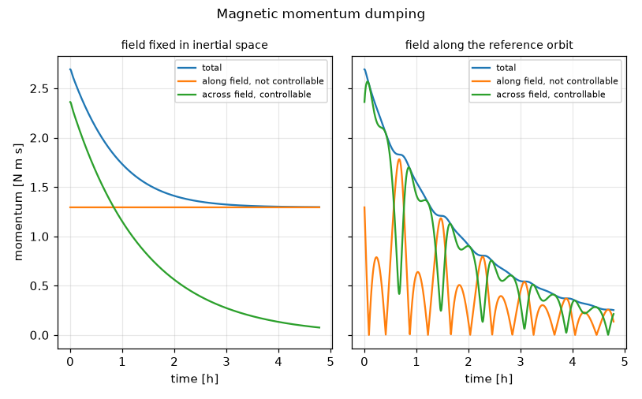
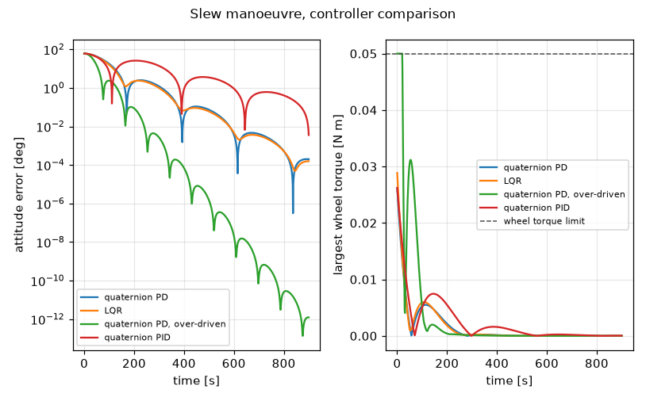
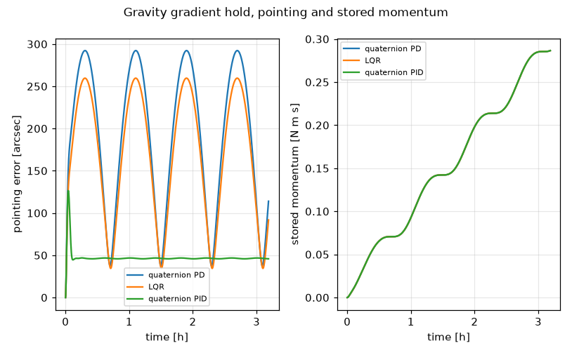

# Spacecraft Attitude Control

Quaternion attitude dynamics with reaction wheel LQR, PD and PID control and
magnetic momentum dumping, for guidance, navigation and control engineers who
want a readable reference implementation to check a design or a derivation
against.

[](https://github.com/Eelis03/spacecraft-attitude-control/actions/workflows/ci.yml)
[](https://www.python.org/downloads/)
[](LICENSE)



A magnetic torque rod produces `L = m x B`, which is orthogonal to the field for
every possible dipole. The left panel is that constraint measured: with the field
frozen in inertial space the component of stored momentum across the field
collapses from 2.3613 to 0.0755 N m s while the component along it sits at
1.2938 N m s from the first sample to the last. Dumping stalls with 48 per cent
of the momentum still on board. The right panel is the same law along the real
orbit, where the field direction sweeps and the uncontrollable direction moves
with it, and 90.6 per cent comes off.

## How this simulation is known to be right

Every result below rests on bookkeeping that closes. These are the checks that
say it does, each one against a closed form or an exactly conserved quantity
rather than against a recorded number.

| Invariant | Value | Where |
| --- | --- | --- |
| Total inertial angular momentum, wheels active, is constant with no external torque | drifts 1.87e-15 N m s over a 900 s slew holding 0.85 N m s | `examples/slew_manoeuvre.py`, `test_inertial_momentum_is_conserved_with_active_wheels` |
| Quaternion norm drift of RK4 equals its closed form `N x^6 / 144`, with `x` the half angle turned per step | predicted 3.39e-9 after 2000 steps, measured agrees to 1 per cent | `test_quaternion_norm_drift_matches_the_integrator_prediction` |
| Accumulated external impulse equals the momentum stored in the wheels | 2.87e-01 N m s against 0.2865 N m s stored, two orbits | `examples/disturbance_rejection.py` |
| Momentum along a fixed magnetic field cannot be changed by any dipole | 5.99e-12 N m s excursion over three orbits of dumping | `examples/momentum_dumping.py`, `test_a_fixed_field_conserves_momentum_along_it_over_a_full_run` |
| Wheel allocation reproduces any achievable commanded torque exactly | to 64 machine epsilons over 200 random commands | `test_allocation_reproduces_the_commanded_torque` |
| The LQR attitude gain is `sqrt(q_att / r) I` for any inertia tensor | 0.04 I, matching the formula to 1e-12 | `test_lqr_attitude_gain_has_a_closed_form` |
| Attitude representations round trip to machine precision | 6.305e-16, 7.407e-16 and 2.264e-14 rad | `examples/attitude_representations.py` |

The first row is the strongest single check on the model: with no external torque
`A(q)^T (J w + W h_w)` must be exactly constant whatever the wheels are doing, so
any sign error, dropped term or mistaken inertia convention shows up in it
immediately. The second is why the integrator does not renormalise the quaternion
inside a step. Renormalising would hide the drift, and the drift has a closed
form, so it is the sharpest diagnostic available.

## Installation

Requires Python 3.12 or later. Continuous integration runs the whole suite on
3.12 and 3.13, on Linux and on Windows, so the version floor in `pyproject.toml`
is a tested claim rather than a declared one.

```bash
git clone https://github.com/Eelis03/spacecraft-attitude-control.git
cd spacecraft-attitude-control
uv sync
```

Using pip instead of uv:

```bash
python -m venv .venv
.venv/bin/activate      # Windows: .venv\Scripts\activate
pip install -e ".[dev]"
```

Slew a spacecraft 60 degrees and read off what it cost:

```python
from attitude_control.analysis.metrics import ManoeuvreMetrics
from attitude_control.configuration import controllers, reference_spacecraft, slew_scenario
from attitude_control.pipeline.scenario import run_scenario

spacecraft = reference_spacecraft()
controller = controllers(spacecraft)[0]  # quaternion feedback PD
trace = run_scenario(slew_scenario(spacecraft, controller))
metrics = ManoeuvreMetrics.evaluate(trace, spacecraft)

print(f"settling time      {metrics.settling_time_s:.1f} s")
print(f"overshoot          {metrics.overshoot_percent:.2f} per cent")
print(f"peak wheel speed   {metrics.peak_wheel_speed_rpm:.1f} rpm")
print(f"peak wheel torque  {metrics.peak_wheel_torque_nm:.4f} N m")
print(f"momentum drift     {metrics.momentum_drift_nms:.2e} N m s")
```

```text
settling time      470.0 s
overshoot          4.16 per cent
peak wheel speed   912.2 rpm
peak wheel torque  0.0262 N m
momentum drift     1.87e-15 N m s
```

## The three problems this models

The kinematics are not linear. Attitude lives on a curved space, so every
parameterisation has either a singularity or a redundancy. Quaternions are
redundant, since `q` and `-q` are the same attitude, and a feedback law that
ignores that will happily command a 350 degree slew where a 10 degree slew would
do. The state here is a unit quaternion, singularity free everywhere, with the
sign ambiguity resolved by a canonical form applied to the error quaternion.
Direction cosine matrices, modified Rodrigues parameters with the shadow set
switch, and 3-2-1 Euler angles are provided as conversions, following Shuster
(1993) and Schaub and Junkins (2018), with Shepperd's method (1978) for the
matrix to quaternion direction so that it stays accurate at 180 degrees.

The actuators are internal. Reaction wheels exchange angular momentum with the
body and cannot change the total, so every torque the environment applies is
stored in the wheels and stays there. A gravity gradient torque of 5.035e-05 N m
deposits 0.1432 N m s into the wheels every orbit, which over the 15.1 orbits in
a day is 2.2 N m s against a 4.0 N m s per wheel limit. The plant is Euler's
equation with the array folded in as
`J w_dot + W u + w x (J w + W h_w) = L_external`, following Hughes (2004) and
Markley and Crassidis (2014), and torque is distributed over a four wheel pyramid
by the minimum norm pseudoinverse with null space speed steering and saturation
on both motor torque and stored momentum.

The one actuator that can remove momentum is fundamentally incomplete, which is
the figure at the top of this page. Unloading uses the cross product law
`m = (k / |B|^2) (h x B)` of Camillo and Markley (1980) against a tilted dipole
field.

Three control laws sit behind one protocol, so a scenario can be re-run with only
the law swapped. Quaternion feedback PD, `L = -K dq_v - P w`, is globally
asymptotically stable by the Lyapunov argument of Wie, Weiss and Arapostathis
(1989), which needs no plant model; its gains `K = 2 wn^2 J` and `P = 2 zeta wn J`
make every axis an identical second order system. The infinite horizon LQR
(Kalman, 1960) is designed on the linearised dynamics and couples the axes where
the PD law does not. The PID law adds `-I x` with `x_dot = dq_v` to remove the
static offset the other two leave under a disturbance, with the integral gain set
to a quarter of the Routh-Hurwitz limit `2 zeta wn^3` and wind-up handled by
conditional integration. See [docs/design-notes.md](docs/design-notes.md) for the
alternatives that were considered and rejected, for what the model leaves out,
and for what closing the integral action limitation cost.

## Results

Every number here is printed by the command shown above it. The vehicle is the
same throughout: inertia `[[90, 5, -3], [5, 100, 2], [-3, 2, 75]]` kg m^2, four
reaction wheels on an isotropic pyramid with 0.0064 kg m^2 axial inertia, a
0.05 N m torque limit and a 4.0 N m s momentum limit per wheel, on a circular
orbit at 550 km altitude and 51.6 degrees inclination. The PD design uses
`wn = 0.02` rad/s and `zeta = 1/sqrt(2)`; the LQR uses weights
`(q_att, q_rate, r) = (1, 1, 625)`, which place its slowest closed loop mode at
0.01979 rad/s, within about one per cent of the PD natural frequency, so the two
are compared at matched bandwidth. The PID design is the PD design plus its
integral term and nothing else.

### Representation accuracy

`uv run python examples/attitude_representations.py`, 20000 random rotations,
worst round trip error measured as a principal angle:

| conversion path | error [rad] | error [deg] |
| --- | --- | --- |
| quaternion to matrix to quaternion | 6.305e-16 | 3.612e-14 |
| quaternion to MRP to quaternion | 7.407e-16 | 4.244e-14 |
| quaternion to Euler 3-2-1 to quaternion | 2.264e-14 | 1.297e-12 |

The worst departure from orthonormality over the same set is 1.221e-15. The
Euler path is a factor of 36 worse than the other two because the extraction
divides by the cosine of the pitch angle, which is small near gimbal lock.

### Slew manoeuvre

`uv run python examples/slew_manoeuvre.py`, a rest to rest 60 degree slew about
the body axis `(1, 2, 2)`, 900 s at a 0.2 s step:



| controller | settling [s] | overshoot [%] | final error [deg] | peak wheel [rpm] | peak wheel torque [N m] | peak stored momentum [N m s] |
| --- | --- | --- | --- | --- | --- | --- |
| quaternion PD | 470.0 | 4.16 | 1.992e-04 | 912.2 | 2.621e-02 | 0.8534 |
| LQR | 379.0 | 3.94 | 1.565e-04 | 946.7 | 2.887e-02 | 0.8839 |
| quaternion PD, over-driven | 192.0 | 3.94 | 1.236e-12 | 1896.2 | 5.000e-02 | 2.0194 |
| quaternion PID | 870.0 | 43.13 | 3.567e-03 | 1177.0 | 2.621e-02 | 1.1013 |

Peak commanded body torque was 0.0366 N m for PD and for PID, 0.0400 N m for
LQR, and 0.2287 N m for the over-driven case, which exceeded the wheel torque
limit and was clipped for 2.3 per cent of the run. The total angular momentum in
the inertial frame drifted by between 1.41e-15 and 1.90e-15 N m s across the four
runs, against stored momenta of order 1 N m s, so the wheel bookkeeping is exact
to rounding.

At matched bandwidth the LQR settles 19 per cent faster than the PD design and
overshoots slightly less, and it pays for that with 4 per cent more wheel speed
and 10 per cent more wheel torque. The reason is the gain structure. The PD gains
are proportional to the inertia tensor, so the closed loop is the same second
order system on all three axes and the heavy axis receives proportionally more
torque. The LQR weights the commanded torque equally on all three axes instead,
which gives its attitude gain the closed form `sqrt(q_att / r) I`, exactly
0.04 I here for any inertia tensor. The result is a faster response on the light
axes and a slower one on the heavy axis, and the mixture settles sooner overall.

The last two rows are the cost of the extremes. The over-driven case reaches the
target in 192 s but only by running the wheels at their torque limit and to twice
the stored momentum, which is the flat top in the right panel. The PID case is
the opposite extreme: on a manoeuvre with no disturbance its integral term has
nothing to remove, so it only accumulates during the approach and has to be
unwound, which is 43 per cent overshoot and 400 s of extra settling time. Its
value appears in the next run, not this one.

### Disturbance rejection

`uv run python examples/disturbance_rejection.py`, an inertial hold over two
orbits at a 1.0 s step. The orbit period is 5739.0 s, the mean motion is
1.094824e-03 rad/s, and the peak gravity gradient torque is 5.035e-05 N m.



| controller | mean error [arcsec] | peak error [arcsec] | mean error vector [arcsec] | stored after 2 orbits [N m s] | per orbit [N m s] | peak wheel [rpm] |
| --- | --- | --- | --- | --- | --- | --- |
| quaternion PD | 190.3 | 292.2 | 144.80 | 0.2865 | 0.1432 | 276.5 |
| LQR | 167.7 | 259.6 | 128.56 | 0.2865 | 0.1433 | 276.5 |
| quaternion PID | 46.3 | 126.5 | 0.09 | 0.2866 | 0.1433 | 276.6 |

The change in total inertial angular momentum over the run is 2.87e-01 N m s for
all three, matching the stored momentum column, which is the impulse invariant
above: the wheels absorbed the whole disturbance and nothing leaked.

The mean error vector column is the one that matters. It averages the error as a
vector rather than as a magnitude, so a constant offset survives it and a zero
mean oscillation cancels. Without integral action the loop settles to the static
gain against the mean disturbance torque, 144.80 arcsec for PD and 128.56 for the
LQR, and the LQR is better only because its attitude gain happens to be larger on
the axes the disturbance loads. With integral action that offset is 0.09 arcsec,
a factor of 1600 smaller, and what remains is the periodic part of the torque
which no integrator can remove: the error vector traces a small circle at the
orbital rate instead of sitting still off target. In magnitude that is 46.3
arcsec mean against 190.3.

The right hand panel is what the numbers cannot show on their own. The three
stored momentum curves lie exactly on top of each other, because momentum
accumulation is set by the environment and not by the control law. Integral
action changes where the vehicle points, not how much has to be dumped: at
0.1432 N m s per orbit, that is 2.2 N m s per day against a 4.0 N m s per wheel
limit, so the array needs unloading within a few days whichever law is flying.

### Magnetic momentum dumping

`uv run python examples/momentum_dumping.py`, starting from 2.6926 N m s of
stored momentum, three orbits at a 2.0 s step, gain 2.0e-4 per second and a
30 A m^2 rod limit. The two runs differ only in whether the magnetic field is
allowed to move, and the figure at the top of this page is this table.

| run | stored start [N m s] | stored end [N m s] | removed [%] | along field start | along field end | across field start | across field end |
| --- | --- | --- | --- | --- | --- | --- | --- |
| field fixed in inertial space | 2.6926 | 1.2960 | 51.9 | 1.2938 | 1.2938 | 2.3613 | 0.0755 |
| field along the reference orbit | 2.6926 | 0.2525 | 90.6 | 1.2938 | 0.1361 | 2.3613 | 0.2127 |

Measured on the exactly conserved quantity, the projection of total inertial
momentum on the field direction, the largest excursion over the fixed field run
is 5.99e-12 N m s, which is integration noise. No gain, no run time and no rod
sizing changes that number, because `m x B` is orthogonal to `B` for every `m`.

Along the real orbit the same law removes 90.6 per cent, because the field
direction sweeps through a large solid angle. On that run the projection of
inertial momentum on the *initial* field direction goes from 1.2938 to 0.0804
N m s: the direction that was untouchable in the first run becomes reachable once
the field has turned. Peak rod dipole stayed below the 30 A m^2 limit in both.

## Reproducing everything above

```bash
uv sync --all-extras --dev
uv run python examples/attitude_representations.py
uv run python examples/slew_manoeuvre.py
uv run python examples/disturbance_rejection.py
uv run python examples/momentum_dumping.py
```

Each example accepts `--quick` for a shortened run and `--no-figure` to skip
plotting, and writes its own plot to `figures/`, which is ignored by git. The
tracked images below `docs/` are written only by the command at the end of this
section. Checks:

```bash
uv run pytest --cov=src/attitude_control --cov-report=term-missing
uv run ruff check .
uv run ruff format --check .
uv run mypy
```

That command measures 99 per cent statement coverage over 1076 statements, and
CI fails the build below 97. The suite has three tiers: property and invariant
tests covering the mathematics, including every row of the invariant table above;
regression tests pinning a recorded run in `tests/data/reference_run.json` with a
tolerance rule per quantity, each derived from how the quantity is computed and
stated in the docstring beside it; and integration tests running each example
script as a subprocess under `--quick`. Quantities that are accumulated rounding,
such as the momentum drift, are checked against a derived bound rather than
pinned, because pinning them would pin the order in which one machine sums a dot
product.

The three figures in this file are snapshots, regenerated by one command:

```bash
uv run python scripts/publish_figures.py
```

It writes `docs/figures/` at the deliberate size and resolution the 250 kilobyte
budget was computed for, 814 by 506 pixels each, and prints the total against
that budget. CI does not compare the committed images byte for byte, because
matplotlib output is not byte reproducible across platforms: font hinting, the
freetype version and the PNG encoder all differ between the Linux and Windows
runners. What CI does check is that the files exist, are valid PNGs, fit the
budget, are the size the budget assumes, and are referenced with real alt text
from the documents that show them.

## Layout

Five layers, each importing only from the ones above it.

| Layer | Contents | Rule it keeps |
| --- | --- | --- |
| `model/` | attitude representations and conversions, inertia and wheel geometry, Euler's equation with wheels, gravity gradient and dipole field | pure, no state and no input or output, every function testable against a closed form |
| `algorithm/` | the controller protocol and the three laws, wheel allocation with null space steering and saturation, cross product unloading | maps a state to a command, never integrates |
| `pipeline/` | fixed step RK4 with the closed form norm drift, scenario configuration and the runner | owns time, produces a trace without interpreting it |
| `analysis/` | manoeuvre metrics, round trip residuals, text tables, figures | only reads traces |
| `configuration.py`, `examples/`, `scripts/` | the reference vehicle, orbit and scenarios shared by examples and tests, then wiring with no logic of its own | the single place where numbers are chosen |

## References

### Papers and books

- Wie, B. and Barba, P. M. (1985). Quaternion feedback for spacecraft large angle
  manoeuvres. *Journal of Guidance, Control, and Dynamics*, 8(3), 360-365.
  DOI [10.2514/3.19988](https://doi.org/10.2514/3.19988). Source of the quaternion
  feedback control law and its Lyapunov stability proof.
- Wie, B., Weiss, H. and Arapostathis, A. (1989). Quaternion feedback regulator
  for spacecraft eigenaxis rotations. *Journal of Guidance, Control, and
  Dynamics*, 12(3), 375-380.
  DOI [10.2514/3.20418](https://doi.org/10.2514/3.20418). Source of the global
  asymptotic stability result and the gain structure used here.
- Kalman, R. E. (1960). Contributions to the theory of optimal control.
  *Boletin de la Sociedad Matematica Mexicana*, 5, 102-119.
  [Stable copy](https://liberzon.csl.illinois.edu/teaching/kalman_optimal_control.pdf).
  Source of the algebraic Riccati equation the LQR design solves.
- Shepperd, S. W. (1978). Quaternion from rotation matrix. *Journal of Guidance
  and Control*, 1(3), 223-224.
  DOI [10.2514/3.55767b](https://doi.org/10.2514/3.55767b). Source of the
  numerically stable matrix to quaternion conversion.
- Shuster, M. D. (1993). A survey of attitude representations. *Journal of the
  Astronautical Sciences*, 41(4), 439-517.
  [Stable copy](http://malcolmdshuster.com/Pub_1993h_J_Repsurv_scan.pdf).
  Reference for the conversions and their singularities.
- Schaub, H. and Junkins, J. L. (2018). *Analytical Mechanics of Space Systems*,
  4th edition. AIAA. DOI [10.2514/4.105210](https://doi.org/10.2514/4.105210).
  Source of the modified Rodrigues parameter shadow set and its kinematics.
- Markley, F. L. and Crassidis, J. L. (2014). *Fundamentals of Spacecraft
  Attitude Determination and Control*. Springer.
  DOI [10.1007/978-1-4939-0802-8](https://doi.org/10.1007/978-1-4939-0802-8).
  Source of the quaternion conventions and the wheel dynamics formulation.
- Hughes, P. C. (2004). *Spacecraft Attitude Dynamics*. Dover.
  ISBN 978-0486439259. Source of the body plus wheel momentum bookkeeping and the
  gravity gradient torque expansion.
- Markley, F. L., Reynolds, R. G., Liu, F. X. and Lebsock, K. L. (2010). Maximum
  torque and momentum envelopes for reaction wheel arrays. *Journal of Guidance,
  Control, and Dynamics*, 33(5), 1606-1614.
  DOI [10.2514/1.47968](https://doi.org/10.2514/1.47968). Reference for the
  pyramid array geometry and its achievable torque set.
- Camillo, P. J. and Markley, F. L. (1980). Orbit-averaged behaviour of magnetic
  control laws for momentum unloading. *Journal of Guidance and Control*, 3(6),
  563-568. DOI [10.2514/3.56036](https://doi.org/10.2514/3.56036). Source of the
  cross product unloading law and the analysis of what it can reach.
- Stickler, A. C. and Alfriend, K. T. (1976). Elementary magnetic attitude control
  system. *Journal of Spacecraft and Rockets*, 13(5), 282-287.
  DOI [10.2514/3.57089](https://doi.org/10.2514/3.57089). Reference for magnetic
  actuation and its limitations.
- Wertz, J. R., editor (1978). *Spacecraft Attitude Determination and Control*.
  Springer. DOI [10.1007/978-94-009-9907-7](https://doi.org/10.1007/978-94-009-9907-7).
  Reference for the environmental torque models.
- Wie, B. (2008). *Space Vehicle Dynamics and Control*, 2nd edition. AIAA.
  DOI [10.2514/4.860119](https://doi.org/10.2514/4.860119). Reference for wheel
  allocation, redundancy resolution, and the Routh-Hurwitz treatment of the
  integral gain.
- Alken, P. et al. (2021). International Geomagnetic Reference Field: the
  thirteenth generation. *Earth, Planets and Space*, 73, 49.
  DOI [10.1186/s40623-020-01288-x](https://doi.org/10.1186/s40623-020-01288-x).
  Source of the dipole tilt and mean equatorial field strength.

### Dependencies

- [NumPy](https://numpy.org/) 2.0 or later, BSD 3-Clause. Array arithmetic and
  linear algebra throughout every layer.
- [SciPy](https://scipy.org/) 1.14 or later, BSD 3-Clause. Only
  `solve_continuous_are`, which produces the LQR gain.
- [Matplotlib](https://matplotlib.org/) 3.9 or later, Matplotlib licence, a
  BSD-compatible licence derived from the Python Software Foundation licence.
  Figures in the analysis layer.
- [pytest](https://pytest.org/) 8.3 or later, MIT, with
  [pytest-cov](https://pytest-cov.readthedocs.io/) 6.0 or later, MIT. Test runner
  and coverage measurement.
- [Ruff](https://docs.astral.sh/ruff/) 0.8 or later, MIT. Linting and import
  ordering.
- [mypy](https://mypy-lang.org/) 1.13 or later, MIT. Static type checking in
  strict mode over the package, the tests, the examples and the scripts. The
  package ships `py.typed`, so the annotations reach anything that installs it.

## License

Released under the MIT license. See [LICENSE](LICENSE).
